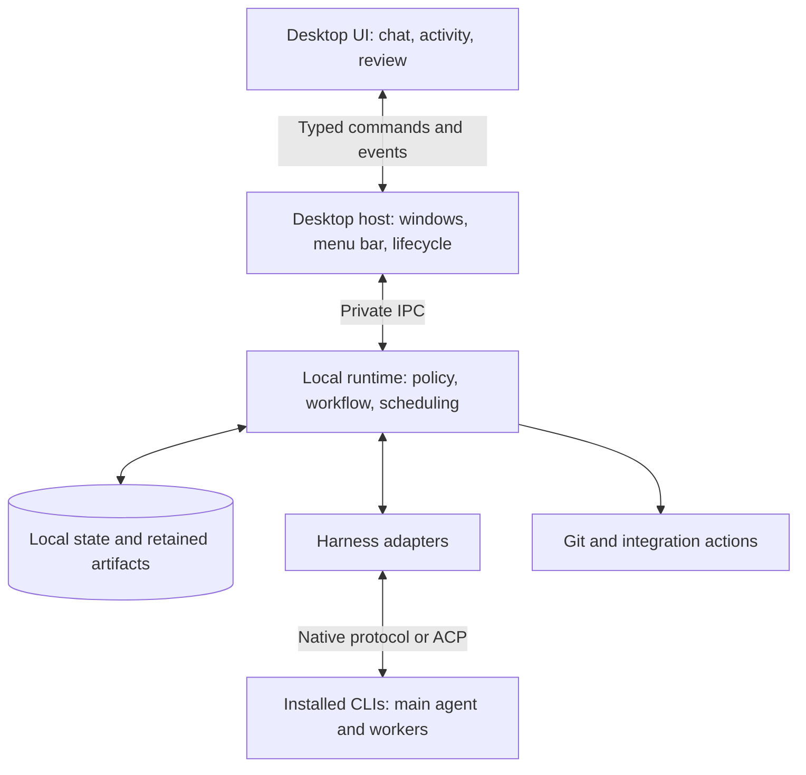

# Randolph architecture

Status: the desktop UI, local execution runtime, harness adapters, and durable storage are approved component boundaries. The selected main agent supplies task judgment; application code controls authorization and execution. The initial Electron/React/TypeScript, SQLite, and native Codex product implementation is recorded in the [desktop slice decision](decisions/desktop-first-slice.md). Remaining schemas, supervision mechanisms, and adapter details below are proposals.

The [product specification](product-spec.md) defines approved behavior; the [user journey](user-journey.md) illustrates it. The [2026-09-11 compatibility experiment](research/harness-compatibility.md) observed subscription paths but did not establish production approval, shutdown, or recovery guarantees. The [first experiment plan](plans/first-controlled-run.md) recorded bounded proofs. Product implementation now proceeds in normal app/runtime packages with unresolved controls kept explicit.

## Decision register

| ID  | Decision                                                                                     | Status and consequence                                                                                                          |
| --- | -------------------------------------------------------------------------------------------- | ------------------------------------------------------------------------------------------------------------------------------- |
| D01 | Separate desktop interaction, execution runtime, adapters, and durable storage               | Accepted boundaries; implementations can change independently                                                                   |
| D02 | Selected main agent supplies task judgment; application code owns authority                  | Accepted; model output cannot authorize its own delivery or raise execution limits                                              |
| D03 | Use installed subscription-backed harnesses, with ACP or native protocols as appropriate     | Accepted direction; capability verification is required per route, with no API fallback                                         |
| D04 | Use AI SDK UI with an application-owned transport                                            | [Implemented over typed Electron IPC](decisions/ai-sdk-chat-transport.md); runtime records remain authoritative                 |
| D05 | Electron/React/TypeScript, runtime hosted in Electron main, SQLite with derived JSONL        | Implemented for the [first desktop slice](decisions/desktop-first-slice.md); independent runtime supervision remains unfinished |
| D06 | Enforce final approval and stop on owner loss through verified native boundaries/supervision | Required behavior; mechanism unresolved and tested first                                                                        |

## Recommendation and alternatives

Build one macOS application with a separately testable local runtime. Keep the runtime's modules in one process initially, separate from the UI, with installed harness processes behind adapters. The selected main agent makes task judgments; deterministic application code controls execution and authorization.

| Approach                                             | Benefit                                                     | Tradeoff                                                                                                               |
| ---------------------------------------------------- | ----------------------------------------------------------- | ---------------------------------------------------------------------------------------------------------------------- |
| Packaged desktop with a local runtime — recommended  | Clear lifecycle, durable execution, replaceable UI/adapters | Requires explicit process and IPC contracts                                                                            |
| UI wrapping CLIs directly                            | Small initial prototype                                     | Approval, persistence, and lifecycle behavior become coupled to views                                                  |
| Independent always-running daemon and desktop client | Can later serve multiple clients                            | Adds installation and lifecycle complexity; conflicts with expected stop-on-quit behavior unless carefully constrained |

Electron, React, TypeScript, and SQLite are selected for the first desktop slice. AI SDK UI uses the application-owned IPC transport. Electron supports separate renderer and utility processes; the slice uses a narrow preload bridge to the runtime in Electron main. [Electron process model](https://www.electronjs.org/docs/latest/tutorial/process-model).

## 1. Boundaries and ownership



**Desktop UI:** renders conversation content, approvals, task activity, documents, and diffs. It submits typed commands and subscribes to durable event cursors. It does not own job lifetime, hold subscription credentials, execute shell commands, or directly edit the runtime database. A refreshed view reconnects to state; reconnecting does not mean restarting work.

**Desktop host:** owns windows, menus, native dialogs, notifications, external-editor opening, and application lifetime. It validates the source and shape of privileged UI requests. Its background-window behavior follows the approved setting. The renderer remains isolated from Node and privileged APIs. [Electron security guidance](https://www.electronjs.org/docs/latest/tutorial/security).

**Local runtime:** owns project/run identity, configuration snapshots, workflow state, scheduling, approval validation, context preparation, process supervision, checkpoints, Git integration, and integration delivery. Modules communicate through explicit internal interfaces; they do not need separate network services.

**Main agent:** is the user's selected harness/model session. It proposes approaches and agent assignments, performs work itself, and requests delegation when useful. It cannot grant itself approval, raise limits, change its authorized assignments, or assert completion on behalf of verification code. The runtime validates its proposals before executing them.

**Adapters:** translate between the runtime's contract and each harness or external integration. They report supported, unsupported, and unverified capabilities explicitly. The UI must not imply equal capabilities merely because all adapters implement the same interface. V1 reuses existing native profiles and logins; optional separate profiles require a post-v1 product and architecture review across harnesses. See [native harness profiles](decisions/native-harness-profiles.md).

### Module map (current)

`Runtime` in `packages/runtime/src/index.ts` is a thin public facade. Collaborators and bounded workflows live in named modules. Native execute/stop/close remain instance methods so tests can intercept them, with their bodies in `run-turn.ts` and `runtime-lifecycle.ts`. The inventory below covers every module under the source directories of the four areas named above, grouped by the responsibility each area owns; the package test directories are out of scope.

#### Local runtime (`packages/runtime/src`)

**Facade and composition**

| Module                | Responsibility                                                                                                                                                                 |
| --------------------- | ------------------------------------------------------------------------------------------------------------------------------------------------------------------------------ |
| `index.ts`            | Public `Runtime` facade: composes collaborators and forwards every desktop command, keeping `execute`, `event`, `finish`, `stop` and `close` as interceptable instance methods |
| `contracts.ts`        | The package's exported type surface: domain records, harness and adapter contracts, application tools, desktop bridge                                                          |
| `runtime-bindings.ts` | The `RuntimeBindings` structural type, and `ActiveRun`, that workflow modules receive instead of the class                                                                     |
| `runtime-hosts.ts`    | Builds the narrow `recoveryHost`, `dispatchHost` and `setupHost` views over those bindings                                                                                     |
| `runtime-status.ts`   | The active run-status set, the active and blocking run predicates, the timestamp helper, and the accepting-gate assertion                                                      |

**Run lifecycle and scheduling**

| Module                 | Responsibility                                                                                         |
| ---------------------- | ------------------------------------------------------------------------------------------------------ |
| `run-dispatch.ts`      | Ordinary send: validate, prepare and retain, then hand the run to execute                              |
| `run-turn.ts`          | The native turn body, adapter-event recording, and run finish                                          |
| `run-execution.ts`     | Read-only execution snapshot for the UI; reading activity never discovers a CLI or admits work         |
| `run-workspace.ts`     | Per-run workspace preparation: own, plan, observe, transfer and release leases                         |
| `runtime-lifecycle.ts` | Stop, stop-all, close, and the active-work query                                                       |
| `runtime-reopen.ts`    | Marks interrupted runs on reopen without restarting work                                               |
| `runtime-catalog.ts`   | Projects, conversations, workspace snapshot, chat events, mark-read, and checkpoint restore            |
| `runtime-harness.ts`   | Harness discovery and adapter selection, model/effort defaults, conversation overrides, execution mode |
| `execution-origin.ts`  | Host and boot identity, and the cleanup-reconciliation reason derived from it                          |
| `session-capacity.ts`  | App-wide and per-harness session limits, reservations, leases and the capacity snapshot                |
| `store.ts`             | SQLite authority: schema, transactions, records, ordered events and run export                         |

**Workspace ownership**

| Module                   | Responsibility                                                                                       |
| ------------------------ | ---------------------------------------------------------------------------------------------------- |
| `workspace.ts`           | Canonical project path and per-conversation worktree preparation                                     |
| `workspace-identity.ts`  | Device/inode identity capture and the fresh identity assertion                                       |
| `workspace-leases.ts`    | In-memory lease registry: snapshot, restore, acquire, bind, release, and the shared lease validation |
| `workspace-ownership.ts` | SQLite lease port; ownership is decided in the database and reopen reconciliation is explicit        |
| `workspace-recovery.ts`  | Reconstructs legacy workspace ownership from deterministic boot witnesses; it never probes a path    |
| `workspace-operation.ts` | Whether a failed synchronous stage may claim confirmed cleanup                                       |

**Checkpoints and restore**

| Module                           | Responsibility                                                                                                                       |
| -------------------------------- | ------------------------------------------------------------------------------------------------------------------------------------ |
| `checkpoints.ts`                 | Checkpoint records: capture at a boundary, failure marking, selection, restore and worktree restore                                  |
| `checkpoint-manifest.ts`         | Manifest types, size limits and validation; pure, with no filesystem or subprocess use                                               |
| `checkpoint-file-io.ts`          | Durable file primitives: existence, canonical directory, sync, durable write, hashing, bounded read, ownership inspection            |
| `checkpoint-git-objects.ts`      | Git object work for snapshots: tree validation, safe init and environment, standalone pack verification, blob materialization policy |
| `checkpoint-storage-io.ts`       | Storage-layer entry point: `loadCheckpoint` plus the manifest, file and Git-object surface its callers use                           |
| `checkpoint-storage.ts`          | Create, read and restore a standalone checkpoint                                                                                     |
| `checkpoint-workspace.ts`        | Linked restore: import checkpoint objects and rebuild the worktree under its own inspection policy                                   |
| `checkpoint-recovery.ts`         | Linked recovery: parse the checkpoint and dispatch restart or rerun                                                                  |
| `checkpoint-recovery-context.ts` | Builds the recovery context and asserts external actions were reconciled first                                                       |

**Git, review, verification and push**

| Module                              | Responsibility                                                                                 |
| ----------------------------------- | ---------------------------------------------------------------------------------------------- |
| `git-execution.ts`                  | The shared Git subprocess helper, its hardened environment, and bounded text capture           |
| `git-workspace-snapshot.ts`         | Git workspace inspection, tree capture, directory identity, and the clean-parent check         |
| `git-review.ts`                     | Builds the review over a workspace snapshot and re-exports the Git surface its callers consume |
| `git-delivery.ts`                   | Delivery plan with separate commit, merge, cleanup and reconciliation outcomes                 |
| `reviews.ts`                        | Review lifecycle: prepare, verify, approve, stop and close                                     |
| `verification.ts`                   | Verification contracts and the bounded check runner over an injected executor                  |
| `verification-command-discovery.ts` | Detects project check commands from workspace manifests                                        |
| `pushes.ts`                         | Push records and the preview, approve, check and stop lifecycle                                |
| `push.ts`                           | Origin push plan and state, with preview, reconcile and execute                                |
| `push-git-transport.ts`             | The push subprocess boundary and the cleanup-unconfirmed error                                 |
| `push-types.ts`                     | `PushOptions` leaf shared by the push modules                                                  |

**Integration**

| Module                     | Responsibility                                                                      |
| -------------------------- | ----------------------------------------------------------------------------------- |
| `integration.ts`           | Integration entry surface: prepare, apply, and superseded-delivery reconciliation   |
| `integration-plan.ts`      | Builds the integration plan from retained sources                                   |
| `integration-apply.ts`     | Applies a plan under lock, with retained reads, rollback and lock release           |
| `integration-contracts.ts` | Entry, file, plan and result types for integration                                  |
| `integration-evidence.ts`  | Identity, detachment, index and path preflight evidence shared by prepare and apply |
| `integrations.ts`          | Per-conversation integration state, blocking checks and resolution confirmation     |

**Delegation — plan and commands**

| Module                          | Responsibility                                                                                                          |
| ------------------------------- | ----------------------------------------------------------------------------------------------------------------------- |
| `delegation-plan.ts`            | Plan defaults and parsing, and the delegation settings file reader and writer                                           |
| `delegation-plan-types.ts`      | Plan, assignment, preset, route and validation types leaf                                                               |
| `delegation-plan-validation.ts` | Validates a delegation plan against roles, limits and sources                                                           |
| `delegation-plan-digest.ts`     | The canonical digest of a plan                                                                                          |
| `delegation-contracts.ts`       | Command input and snapshot types for the delegation surface                                                             |
| `delegation-commands.ts`        | The delegation command workflow: snapshot, revise, reject, approve, save preset                                         |
| `delegation-command-policy.ts`  | The command policy assembled from live readers, so the composition root can build it before its dependencies exist      |
| `delegation-preset-saves.ts`    | The preset-save saga: intent, the file-plus-SQLite receipt, and crash reconciliation; saving never authorizes execution |
| `delegation-basis.ts`           | Retains the run basis and asserts a plan is authorized against it                                                       |
| `delegation-tools.ts`           | Definitions and implementations of the application tools offered to a harness                                           |

**Delegation — records**

| Module                            | Responsibility                                                                                   |
| --------------------------------- | ------------------------------------------------------------------------------------------------ |
| `delegation-records.ts`           | Plans, authorizations, preset saves, tasks and sessions behind one record surface                |
| `delegation-records-types.ts`     | The delegation record type declarations leaf                                                     |
| `delegation-session-records.ts`   | Session transactions, tool receipts, and session reconciliation on reopen                        |
| `delegation-tasks.ts`             | Task records: creation, cancellation, readiness, and the reopen projection                       |
| `delegation-attempt-lifecycle.ts` | Durable per-attempt transition ledger; it admits and records intent but never launches a process |
| `delegation-task-state.ts`        | The shared terminal-task predicate                                                               |

**Delegation — execution**

| Module                              | Responsibility                                                                             |
| ----------------------------------- | ------------------------------------------------------------------------------------------ |
| `delegation-control.ts`             | Durable admission and budget accounting; this module never launches or cancels a process   |
| `delegation-coordinator.ts`         | The explicitly driven task graph; construction and reopen never schedule execution         |
| `delegation-task-runner.ts`         | The per-task pipeline, rebuilt for each claim, which never receives the claim id           |
| `delegation-sources.ts`             | Resolves, prepares and captures delegation input and output sources                        |
| `delegation-integration.ts`         | Plans and applies the delegation integration into the owning workspace                     |
| `delegation-integration-sources.ts` | Resolves target and input sources from a proven authority triple                           |
| `delegation-integration-stage.ts`   | Durable candidate receipt for the main-integration task; it prepares data only             |
| `delegation-native.ts`              | Executes one prepared authorized attempt; success is recorded only after output validation |
| `delegation-verification.ts`        | Runs at most one retained check; the next check requires fresh admission                   |
| `delegation-checks.ts`              | Durable command-check ledger; command execution stays with the scheduler                   |

**Native admission**

| Module                           | Responsibility                                                                                           |
| -------------------------------- | -------------------------------------------------------------------------------------------------------- |
| `native-admission.ts`            | The one native admission owner; SQLite settlement precedes releasing process capacity                    |
| `native-admission-queue.ts`      | Waiting requests, which own neither a process nor an execution budget                                    |
| `native-admission-recovery.ts`   | Startup reconstruction for the admission owner, in the order the constructor used                        |
| `native-admission-types.ts`      | Admission context and cleanup types leaf                                                                 |
| `native-operation-records.ts`    | SQLite authority for native process intent and cleanup state; it never launches or terminates a process  |
| `native-setup-reconciliation.ts` | Setup-reconciliation eligibility and the durable later-boot session proof                                |
| `native-legacy-ownership.ts`     | Read-only bridge for native work created before operation receipts existed                               |
| `admitted-harness-adapter.ts`    | Routes every adapter call through the admission owner's `perform`, holding no admission state of its own |

**Memory and lessons**

| Module                 | Responsibility                                                                                 |
| ---------------------- | ---------------------------------------------------------------------------------------------- |
| `memory.ts`            | Project memory: snapshot, history, commands, context preparation and retention                 |
| `memory-settings.ts`   | Memory preferences file reader and writer                                                      |
| `lessons.ts`           | Lesson content and version history; effective approval configuration is supplied by the caller |
| `lesson-types.ts`      | Lesson contract types leaf                                                                     |
| `lesson-validation.ts` | Lesson normalization and bounds, and scope and applicability checks                            |

**Project setup and configuration**

| Module                          | Responsibility                                                                                  |
| ------------------------------- | ----------------------------------------------------------------------------------------------- |
| `project-setup.ts`              | The setup prompt and the parsed setup proposal                                                  |
| `project-setup-runtime.ts`      | Inspection conversations, cleanup reconciliation, and context approval                          |
| `project-setup-snapshot.ts`     | The setup snapshot projection and its cleanup-eligibility rule behind a narrow source interface |
| `project-context.ts`            | Project context file reader and writer                                                          |
| `project-context-validation.ts` | Project context parsing and validation                                                          |
| `harness-settings.ts`           | Harness defaults and route validation for `config.harness.yaml`                                 |
| `app-settings.ts`               | Application preferences and global memory settings, with revision-checked saves                 |
| `yaml-settings.ts`              | Revision-checked YAML read and replacement used by every settings file                          |
| `canonical-json.ts`             | Canonical JSON ordering for digests                                                             |

#### Harness adapters (`packages/harness-codex/src`, `packages/harness-grok/src`)

**Codex**

| Module                 | Responsibility                                                                                                                      |
| ---------------------- | ----------------------------------------------------------------------------------------------------------------------------------- |
| `index.ts`             | `CodexAdapter`: the composition point over the process host, discovery, command and turn modules                                    |
| `codex-shared.ts`      | Shared adapter types, line and text limits, the verified-version pin, and small value helpers                                       |
| `codex-rpc.ts`         | The line-delimited JSON-RPC client                                                                                                  |
| `codex-launch.ts`      | `CodexProcessHost`: executable candidates, environment, launch and initialize, notification identity, workspace policy, termination |
| `codex-discovery.ts`   | Installations and capability discovery, re-entering through the host for an alternate executable                                    |
| `codex-command.ts`     | One command execution as a single process lifecycle                                                                                 |
| `codex-turn.ts`        | The streamed turn, including abort ordering and event translation                                                                   |
| `application-tools.ts` | Translates application tool definitions, requests and results to and from the Codex wire shape                                      |

**Grok**

| Module               | Responsibility                                                                                                     |
| -------------------- | ------------------------------------------------------------------------------------------------------------------ |
| `index.ts`           | `GrokAdapter` over `GrokProtocol`                                                                                  |
| `grok-shared.ts`     | Shared adapter types, the verified version pins, and value helpers                                                 |
| `grok-rpc.ts`        | The ACP client                                                                                                     |
| `grok-launch.ts`     | `GrokProcessHost`: candidates, environment, launch, version, model parsing, termination, and spawn-failure cleanup |
| `grok-admission.ts`  | Provider and configuration admission, and discovery through an injected adapter factory                            |
| `protocol.ts`        | The ACP session: run and session callbacks, tool-catalog validation, workspace access, and cancellation            |
| `workspace-files.ts` | The authorized worktree file boundary; operations reject redirects and revalidate identity before publication      |

#### Desktop host (`apps/desktop/src`)

| Module                     | Responsibility                                                                                     |
| -------------------------- | -------------------------------------------------------------------------------------------------- |
| `main.ts`                  | Electron bootstrap: window, runtime, shutdown, navigation, menu, and the guarded command registrar |
| `main-ipc.ts`              | Registers every domain channel through that guarded registrar                                      |
| `main-tray.ts`             | Tray and notification policy, with its own state                                                   |
| `preload.ts`               | The `DesktopBridge` exposed over `contextBridge`; the renderer's only path to the runtime          |
| `validation.ts`            | Parses and validates the core desktop command payloads                                             |
| `delegation-validation.ts` | Parses the delegation command payloads                                                             |
| `memory-validation.ts`     | Parses the memory command payloads                                                                 |

#### Desktop UI (`apps/desktop/src/renderer`)

**Screens and panels**

| Module                           | Responsibility                                                             |
| -------------------------------- | -------------------------------------------------------------------------- |
| `main.tsx`                       | React root mount                                                           |
| `App.tsx`                        | Application shell: screen selection, dialogs, and the shared session state |
| `Sidebar.tsx`                    | Project and conversation navigation with unread counts                     |
| `WorkspaceHome.tsx`              | Workspace landing view over projects, conversations and runs               |
| `Welcome.tsx`                    | First-run view when no project is registered                               |
| `ConversationScreen.tsx`         | The conversation screen: header, messages, activity and composer wiring    |
| `Composer.tsx`                   | Message composer with harness, model and effort selection                  |
| `MessageBubble.tsx`              | One chat message                                                           |
| `ActivityPanel.tsx`              | Run activity column: status, last response, and execution snapshot         |
| `RunActivity.tsx`                | Execution snapshot detail inside that column                               |
| `HistoryPanel.tsx`               | Run history dialog and its recovery actions                                |
| `HistoryRunList.tsx`             | The selectable run list inside history                                     |
| `CheckpointRecoverySection.tsx`  | Checkpoint restart and rerun controls                                      |
| `RecordedOutcomeSections.tsx`    | Recorded reviews, events and messages for a past run                       |
| `ReviewPanel.tsx`                | Review dialog: verification basis, approval, and push entry                |
| `PushControls.tsx`               | Push preview, approval and status controls                                 |
| `MemoryPanel.tsx`                | Memory dialog shell and its history fetch                                  |
| `MemoryLessonList.tsx`           | Lesson list                                                                |
| `MemoryLessonEditor.tsx`         | Lesson draft editor                                                        |
| `MemoryPreferencesSection.tsx`   | Project and global memory preferences                                      |
| `DelegationPanel.tsx`            | Delegation plan panel: revision history, actions, and parent-only approval |
| `DelegationAssignmentEditor.tsx` | Assignment fields and the execution-limits fieldset                        |
| `DelegationPresetForm.tsx`       | Preset save form                                                           |
| `DelegationConversation.tsx`     | Delegation activity for the conversation                                   |
| `ProjectSettings.tsx`            | Project settings dialog                                                    |
| `HarnessSelectionFields.tsx`     | Harness, model and effort fields                                           |
| `RoutePermissions.tsx`           | Per-route executable permissions                                           |
| `ProjectSetup.tsx`               | Project setup dialog                                                       |
| `ProjectSetupActivity.tsx`       | Setup inspection activity                                                  |
| `ProjectSetupProposal.tsx`       | The proposed context awaiting approval                                     |
| `ProjectSetupApproved.tsx`       | The approved context summary                                               |
| `AppSettings.tsx`                | Application settings screen                                                |
| `icons.tsx`                      | Inline SVG marks used by the shell                                         |

**View logic and transport**

| Module                       | Responsibility                                                                                   |
| ---------------------------- | ------------------------------------------------------------------------------------------------ |
| `chat-transport.ts`          | Barrel that the renderer bundle and the transport test import                                    |
| `chat-transport-types.ts`    | Bridge and message types leaf                                                                    |
| `chat-message-projection.ts` | Projects SQLite messages into SDK messages; one response groups a run's native text parts        |
| `native-chat-transport.ts`   | The AI SDK transport over the desktop bridge                                                     |
| `native-chat-session.ts`     | Keeps SDK presentation local to a conversation while native execution outlives its view          |
| `useWorkspaceSession.ts`     | Workspace session state: snapshot, screen, dialogs, drafts, settings and busy action             |
| `useConversationActions.ts`  | Conversation actions bound to that session and the bridge                                        |
| `workspace-helpers.ts`       | Empty snapshot, blocking statuses, native event types, error display, sequence and unread counts |
| `delegation-plan-editor.ts`  | Plan editing helpers: normalization, empty assignment, local errors                              |
| `history-panel-types.ts`     | The pending-recovery type leaf                                                                   |
| `memory-panel-types.ts`      | The memory failure-message helper leaf                                                           |
| `time.ts`                    | Absolute and relative time formatting                                                            |
| `global.d.ts`                | Declares `window.randolph` as the desktop bridge                                                 |
| `styles.d.ts`                | Declares CSS imports for TypeScript                                                              |

**Stylesheets**

| Module                     | Responsibility                                                                                                      |
| -------------------------- | ------------------------------------------------------------------------------------------------------------------- |
| `styles.css`               | Import order for every sheet; the theme sheet stays last                                                            |
| `styles-tokens.css`        | Base element rules and the `:root` colour and spacing tokens                                                        |
| `styles-shell.css`         | App shell grid, sidebar navigation, activity-panel frame and shared buttons                                         |
| `styles-workspace.css`     | Conversation area: header, message column, welcome and harness-readiness states                                     |
| `styles-composer.css`      | Composer area with its toolbar, selectors and errors                                                                |
| `styles-status.css`        | Status cards, dots and rows, inline errors and the stop button                                                      |
| `styles-events.css`        | Event list and detail, header actions, run identifier and native records                                            |
| `styles-settings.css`      | Project settings dialog, route permissions and the shared settings fields                                           |
| `styles-project-setup.css` | Project setup dialog with its activity, proposal and approved states                                                |
| `styles-review.css`        | Review dialog                                                                                                       |
| `styles-memory.css`        | Memory dialog                                                                                                       |
| `styles-run-notices.css`   | Run-scoped notices rendered by the conversation screen and the activity panel                                       |
| `styles-push.css`          | Push controls                                                                                                       |
| `styles-history.css`       | History dialog                                                                                                      |
| `styles-theme.css`         | Dark-theme rules for the panels, plus the history and checkpoint surfaces; imported last                            |
| `app-navigation.css`       | Theme variables with their explicit and system dark overrides, and shell and sidebar theming; imported by `App.tsx` |
| `DelegationPanel.css`      | Delegation panel, imported by its component                                                                         |
| `RunActivity.css`          | Run activity, imported by its component                                                                             |

This map is navigation, not a folder reshuffle.

## 2. Execution model

The main objects are Project, Conversation, Run, Task, AgentSession, PlanRevision, Approval, Checkpoint, Event, Artifact, and ExternalAction. These are proposed model concepts, not an approved database schema.

- A conversation has at most one active run. Restart creates a linked run in that conversation; deliberate rerun creates a linked conversation. Paused work resumes its existing run.
- A run captures its initial configuration and can accumulate explicitly authorized plan revisions. Every task identifies its assigned role, harness/model/effort, dependencies, completion requirements, workspace, and applicable limits.
- An AgentSession records the mapping to provider session and process identities. Runtime run IDs are not provider session IDs.
- Project context and integration access are scoped by stable project identity. Global coordination is limited to app settings, capacity, attention, and explicitly applicable global memory.

A normal dispatch follows this order: accept a versioned command; validate scope, approvals, capabilities, and limits; save its authorized intent; acquire a slot and workspace ownership; prepare and retain context; launch or address the agent; collect evidence; record the outcome. A launch intent without a confirmed process/session outcome is reconciled after failure, not blindly retried.

Use one modest workflow interpreter with dependencies and completion checks. Flexible workflows allow the agent to propose steps inside the approved outcome and constraints. Prescribed workflows constrain steps explicitly. A simple request is one task handled by the main agent; it should not require a separate planner model, optimizer model, or review panel unless selected requirements call for one.

The initial scheduler supports app-wide and per-harness limits, per-checkout writer ownership, visible waiting reasons, and priority for the next available slot. A waiting coordinator must not indefinitely occupy all capacity needed by its children. Account for active inference and live process/session limits separately where a harness requires it.

## 3. UI transport and agent communication

Use AI SDK UI as the chat presentation layer, with a custom transport over the application's private IPC bridge. The runtime owns the conversation/event record; AI SDK state is its presentation. Its transport interface supports custom backends, so this does not require AI Gateway or a model API. The [desktop integration](decisions/ai-sdk-chat-transport.md) implements this boundary with retained-event replay and separate native activity. [AI SDK transport](https://ai-sdk.dev/docs/ai-sdk-ui/transport).

Use scoped application tools for delegation, retrieving task results, and proposing plan revisions. MCP is a suitable adapter for exposing those tools to supported harnesses. Each tool call carries a runtime-established run/session identity; a caller cannot claim another project's identity in ordinary arguments.

ACP supplies an app-to-agent protocol, including session setup and negotiated capabilities. The app remains the coordinator of communication between agents. Its session model can carry working-directory and MCP-server configuration; optional load/resume features must be checked before use. [ACP session setup](https://agentclientprotocol.com/protocol/v1/session-setup).

Proposed initial harness routes:

| Harness | Initial route to prove                                                             | Why                                                                                                |
| ------- | ---------------------------------------------------------------------------------- | -------------------------------------------------------------------------------------------------- |
| Codex   | Installed Codex App Server over stdio                                              | Direct native model/effort discovery, sessions, events, and approval requests                      |
| Grok    | Native ACP through the installed CLI                                               | First-party support for integration through ACP                                                    |
| Claude  | Unmodified installed CLI with structured streaming and documented control surfaces | Fits the accepted investigation direction without making the SDK-backed ACP wrapper a prerequisite |

The Codex App Server documentation describes stdio, version-specific schema generation, and model discovery. The recorded experiment used Codex CLI 0.149.0; future runs must discover and record the installed version. [Codex App Server](https://developers.openai.com/codex/app-server/). Grok documents native ACP integration. [Grok Build](https://docs.x.ai/build/overview). Claude documents newline-delimited streaming output, which establishes an output interface but does not prove our permission or lifecycle integration. [Claude programmatic use](https://code.claude.com/docs/en/headless).

Keep the accepted Claude subscription assumption unchanged; do not represent it as vendor approval. The [compatibility summary](research/harness-compatibility.md) separates observed behavior from open questions. All three harnesses still need pinned-version compatibility and effective subscription-authentication proofs before claiming production support. No silent API fallback.

Authentication remains harness-owned. The app records readiness and effective authentication mode without copying token stores. Discovery of an executable, protocol compatibility, authenticated readiness, supported model/effort, and verified execution controls are separate checks.

## 4. Approvals are executable policy

An approval references the exact plan or deliverable revision, action scope, target revision where relevant, and applicable approval policy. UI cards submit a decision against that identity. The runtime rejects stale or mismatched commands atomically. A model-produced message saying “approved” is not an approval record.

YOLO is an application policy for permitted intermediate decisions, with recorded automatic authorizations. It is not synonymous with disabling every native harness permission control. Final acceptance/delivery, exhausted execution limits, and separately authorized push/publish/send actions retain their explicit boundaries.

Final delivery is a recoverable sequence: verify the review basis, commit, merge, clean up, and advance the issue where applicable. Serialize app-managed finalization for the same repository/target branch, and recheck parent and reviewed work immediately before mutation. Do not hold a broad repository lock while waiting for human approval. External edits can still race app locks; conditional revision checks and reconciliation are required.

**Unresolved enforcement requirement:** putting commit/merge/push behind runtime tools does not by itself stop an agent from invoking Git or a network client through its own shell. Hooks and prompts alone are insufficient for a hard guarantee. The implementation must prove a native permission/filesystem/network boundary or a fully mediated execution route for these protected actions, including harness-native subagents and inherited tools.

Do not quietly weaken the approved final-approval requirement. If the three harnesses cannot supply an adequate boundary in v1, return with the demonstrated limitation and a specific design choice. Worktrees provide source isolation but share repository metadata. Full application sandboxes/micro-VMs remain deferred; this proposal does not pull them into v1. Claude documents native sandbox controls, but that is only a candidate mechanism until verified for this integration. [Claude sandboxing](https://code.claude.com/docs/en/sandboxing).

## 5. Process lifetime and truthful activity

The desktop host starts the runtime; the runtime supervises app-owned harness sessions. Closing a window with background execution enabled keeps the host/runtime alive. Explicit quit stops work. A runtime crash cannot trigger automatic agent restart.

For normal Stop, close the dispatch gate first, revoke pending execution permissions, signal native cancellation, terminate owned process groups as required, and confirm exits. Late output can be recorded as evidence but cannot schedule new work. Pause stops new dispatches and waits for active operations to reach a supported boundary; cancellation must not be mislabeled as resumable pause.

Use a narrowly scoped lifecycle supervisor or equivalent verified parent-loss mechanism that can stop children if the UI host/runtime dies. This is a proposed lifecycle mechanism inside the application, not an independent job daemon. Persist process identity with enough information to avoid targeting reused PIDs. Reopening performs reconciliation and does not restart models.

**Proof required:** killing a renderer, the Electron host, the runtime, and a harness are different failures. A process group alone cannot guarantee control of deliberately detached descendants. The product must not show “Stopped” until its owned execution has been confirmed stopped. Outstanding or unverifiable execution must remain visible. This is an implementation acceptance condition, not a silent downgrade of the user's stop-on-kill expectation.

Activity is driven by normalized events with references to retained native output. Each event has project/conversation/run/task/session identifiers as applicable, sequence, timestamps, type, concise summary, and structured details. Distinguish process liveness, last confirmed work event, and last UI delivery. A live pipe or animation is not proof of useful agent progress.

The UI subscribes from a durable cursor and can recover missed updates. Replaying history into a view cannot execute commands. Stream buffering and batching may reduce overhead but must preserve evidence before the UI claims a durable checkpoint or completed action.

## 6. Storage and configuration authority

Use three explicit sources of authority:

| Material                                             | Authority                             | Presentation / derived forms                          |
| ---------------------------------------------------- | ------------------------------------- | ----------------------------------------------------- |
| Editable project configuration                       | Focused versioned YAML files          | Validated UI forms and run-start snapshots            |
| Run state, approvals, ordered events, action intents | Local SQLite transactions             | Activity views, inbox, JSONL logs, readable summaries |
| Retained source snapshots, context, artifacts        | Durable immutable files and manifests | Previews, search index, checkpoint views              |

Propose one local SQLite database initially, with project-scoped access and queries. It provides local transactions without requiring a server. Its transaction mechanism supports atomic database commits; it does not make Git, files, or Linear part of the same transaction. [SQLite atomic commit](https://www.sqlite.org/atomiccommit.html).

Write a state transition, its event, and any external-action intent in one database transaction. Generate per-run JSONL logs from those ordered events with recorded export positions. After a crash, regenerate missing or damaged log projections; never make independently appended JSONL and SQLite competing authorities. The readable UI and generated summaries use the same events.

For files, durably publish content and a checksum manifest before a transaction declares it referenced and recoverable. Reconcile orphan files and missing content explicitly. Stop new effectful dispatch when the runtime cannot durably record required intent/evidence; surface the storage failure instead of continuing without a trace.

Proposed layout. `$APP_DATA` denotes Randolph's global host data directory; the physical root and schema are not yet selected:

```text
$APP_DATA/
  app.sqlite
  config.app.yaml
  projects/<project-slug>--<stable-id>/
    runs/<YYYYMMDD>_<run-id>/
      manifest.json
      logs/events.jsonl
      logs/harness/
      context/
      artifacts/
      checkpoints/
```

Project configuration remains versioned inside the repository using the approved dot-separated filenames; its exact directory remains a design choice. Worktrees remain inside the repository. Temporary scratch uses the OS temporary directory and has no recovery authority. This layout is proposed, not a stable storage API.

Three project configuration files live at the registered project root, each read and replaced through the revision-checked path in `yaml-settings.ts`: `config.harness.yaml` owns model/effort defaults and enabled harness routes (`harness-settings.ts`); `config.delegation.yaml` owns delegation routing, presets and the default preset (`delegation-plan.ts`); `config.memory.yaml` owns memory auto-approval and framework versions (`memory-settings.ts`). SQLite owns conversation overrides and frozen run selections. The [project harness defaults decision](decisions/project-harness-defaults.md) records resolution order, external-edit detection, and bounded read/write behavior; the same rules apply to the other two files. The desktop slice decision records the selected app-data layout.

YAML edits are validated with an expected revision/hash before replacement. Invalid external edits remain visible and block affected new runs; they do not silently replace the last valid active snapshot. Detect duplicate checkouts through canonical repository identity so per-checkout writer ownership cannot be evaded by a symlink or a second project registration.

## 7. Checkpoints and finalization recovery

A recoverable checkpoint requires a durable manifest plus enough content to restore the approved boundary after temporary worktrees and branches are removed. Retain the necessary base Git objects or a self-contained equivalent, tracked changes, required untracked/binary content, referenced artifacts, decisions, plan/config/context versions, and external-action records. A base SHA alone is insufficient if its objects can later be garbage-collected or the original repository becomes unavailable.

Capture at a quiescent boundary: finish or pause writers, determine the source revision/content identity, persist the snapshot, and verify its manifest before labeling it recoverable. No additional model invocation is required; the selected agents' existing outputs and runtime records supply the work state. Restorability tests must actually remove the original worktree and required source objects from the test environment.

Provider sessions are useful continuation aids, not the sole recovery store. A session that contains work after the selected checkpoint cannot be blindly resumed. Restore with a compatible clean session and retained context when necessary; show degraded compatibility if the required model, harness version, referenced data, or environment is unavailable. Do not silently substitute models or imply complete reproduction of an external environment.

For external actions, persist intended operation and preconditions before execution, then reconcile the observed result. Commit, merge, cleanup, and issue update each have separate outcomes. If an operation succeeded but its response was lost, check the target state before retrying. Where a remote system cannot establish whether an effect happened, present an uncertain outcome for resolution; do not claim exactly-once external delivery.

## 8. Common context, memory, and extensions

Prepare a canonical context packet containing task outcome, constraints, relevant project documents, selected skills, applicable pinned/retrieved lessons, and the authorized plan. Preserve source references and content versions. Use deterministic selection and deduplication first; additional summarization must earn its cost and cannot silently omit mandatory context.

Maintain shared agent and skill definitions in project configuration, with adapter-specific rendering and support reporting. Hook triggers should be application lifecycle events where possible. Native equivalents may supplement them only where semantics are verified. A mandatory unsupported hook/control makes a route incompatible; optional degradation is visible.

Existing native global/project instructions, integrations, and subagents may load automatically. Do not import them into app configuration or silently edit user home configuration. Inventory and freeze their effective influence where supported; otherwise show the compatibility limitation. “Common context” must not falsely promise identical hidden prompts across vendors.

Built-in memory should work with local text/tag/version search first, behind a consistent retrieval interface. Semantic indexing can be optional if later justified without a paid API prerequisite. Project/global applicability, approval, source version, and provenance accompany each retrieved lesson. Optional external knowledge stores participate through the same interface and remain separate from public core data and examples.

Linear and optional memory write-back use runtime-owned action records and reconciliation. Provider-native connectors must not bypass the approved external-action policy. Limit initial extension contracts to actual v1 integrations and shared packs; do not build a marketplace or generic plugin host yet.

## 9. Proofs before committing to adapter implementation

The architecture can be reviewed now. Production adapter support requires an explicitly scoped experiment covering:

1. Effective subscription authentication, capability discovery, and a harmless streamed turn for each supported harness; no API fallback.
2. App-mediated delegation with visible worker activity, supported model/effort selection, bounded context, and no untracked native worker expansion.
3. Protected-action enforcement against alternate shell/tool routes, stale approval rejection, and separate push authorization.
4. Pause/Stop and host/runtime/harness kill tests, with descendant shutdown and no automatic post-crash execution.
5. Crash recovery at file, database, log-export, checkpoint, and finalization boundaries; restore after source worktree removal and avoid duplicated effects.

Use fake adapters for deterministic runtime tests and real pinned harness versions for compatibility tests. A fake passing an interface test does not establish actual cancellation, auth, or tool-permission behavior. Production support stays unverified until these proofs pass.

## Review boundary

The user approved the high-level component boundaries and separation of agent judgment from runtime authority. Detailed storage authorities and adapter implementation choices remain proposals. Two critical compatibility conditions remain unverified: enforceable approval boundaries around native tools, and descendant-process shutdown after application failure. Detailed schemas, package boundaries, version selection, and installation/signing require further design. No implementation or release approval is inferred.
