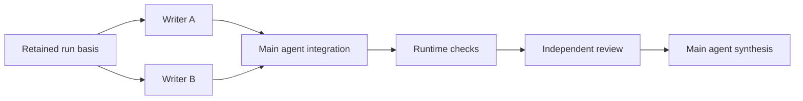

# Delegation and controlled worker execution

Status: approved for implementation by the user on 2026-09-12 after independent review. Grok-only Code execution remains required and separately blocked by native compatibility findings. The [product specification](../product-spec.md) approves the behavior and the [architecture](../architecture.md) approves the component boundaries. Approval authorizes implementation; capabilities remain disabled until their implementation and verification gates pass.

## Review corrections incorporated

Integration is an explicit authorized main-agent phase before dependent review, rather than a continuation that waits for those reviewers. Every task declares its exact source snapshot; completion dependencies alone never imply a merge. Budgets cover runtime preparation, integration, verification, and native execution. Main continuation preserves selected configuration and retained application context, not hidden provider state. Independent review approved the corrected design. The user approved implementation on 2026-09-12.

## Outcome and scope

The user's selected main agent can propose useful worker assignments across enabled harnesses. The user can edit and approve the exact proposal, select an already authorized preset, and inspect each worker's activity and results. Randolph owns admission, queues, workspaces, limits, interruption, and delivery authority. A simple conversation still uses only its selected main agent.

This group implements proposals, presets, worker execution, and main-agent continuation. The complete v1 still requires the fourteen workflows, remaining context and backlog capabilities, all three native harnesses, lifecycle proofs, and distribution. These are dependencies or subsequent groups, not removed scope.

## Execution choice

Use application-owned tools to record proposals, then dispatch workers at a completed native-turn boundary. A logical conversation run can contain several native sessions: the selected main agent, authorized workers, and a continuation of the same selected main agent with retained results. Each session has its own provider/process identity and outcome.

The main agent's proposal tool returns a bounded receipt immediately. It cannot start workers. After the native turn and its process cleanup finish, Randolph freezes the relevant source/context basis and makes the proposal actionable. Approval starts the authorized task graph; terminal worker results become retained input to the next main-agent session. Existing preset selection supplies authorization without another approval card.

This preserves the selected main agent's identity, model, effort, and context without depending on provider thread persistence. The runtime reconstructs continuation from retained application messages, context, and worker results. The UI distinguishes a new native session from the same logical run. It does not claim a provider session was resumed.

Alternatives considered:

- Hold a native tool call open through human approval and worker completion. This preserves provider session continuity, but consumes live processes, complicates pause/time accounting, and requires unproven long-wait behavior and capacity reservations.
- Extract runnable assignments from ordinary assistant prose or JSON. This is simpler initially, but conflates conversational output with control requests and makes identity, replay, and malformed-output handling less explicit.

The turn-boundary approach provides a concrete point at which no preceding native command should remain active. It still requires honest cleanup evidence; existing unconfirmed-cleanup states cannot authorize the next session. It does not solve the known detached-descendant or owner-loss failures.

## Configuration and records

Keep project-editable presets and routing preferences in versioned `config.delegation.yaml`. Use the existing bounded YAML read/validate/compare/write discipline, preserve unrelated configuration, detect external changes, and retain exact versions on admission.

Project-specific execution enablement is a prerequisite. Extend the versioned `config.harness.yaml` codec with explicit enabled harness/CLI entries while preserving its current selected-main defaults and revision checks. CLI discovery alone never authorizes a worker. For legacy configuration without an enablement list, retain only the existing selected main route for compatibility; require an explicit project setting before proposing executable foreign-harness assignments. The proposal displays unavailable/disabled assignments as editable and refuses approval until enabled. Authorization snapshots the enabled routes. The runtime rechecks that frozen authorization, current executable/version availability, and explicit revocations on every admission. Later project configuration edits affect new runs only. Explicitly revoking a route for already authorized work is a separately recorded run-control decision that stops affected queued admissions and applies the existing Stop/cleanup rules to any chosen active attempts; no silent rebinding occurs.

Project routing is `fast`, `balanced`, or `thorough`; absent means `balanced`. Conversations inherit it or explicitly override it. This preference guides the main agent's proposed assignments. It never changes the selected main agent, silently chooses a substitute, or relaxes approval/check requirements.

A preset contains a stable ID, name, revision, assignments, any required main integration and runtime verification phases, dependencies, source selectors, limits, and optional import provenance. Saving a proposal as a preset is independent of approving execution. Selecting a preset for a conversation is explicit authorization to instantiate that exact version on the next submitted request. Merely configuring a project default does not start work. The selected default appears in the composer before submission and can be removed or replaced.

Template expansion is limited to explicit application-owned context fields such as the submitted request. It is data substitution, never shell or executable template evaluation. The concrete expanded assignments are retained and visible in the run banner. A changed preset after admission affects only later runs.

Persist these additional records in SQLite with additive schema migration and legacy-run compatibility:

- **Plan revision:** run ID, version/digest, request identity, source (proposal or selected preset), complete displayed content, context/source basis, creation time, and disposition.
- **Authorization:** exact plan digest and basis, explicit user action or permitted intermediate YOLO decision, time, and separate preset-save choice. Revoked/stale authorizations remain historical records.
- **Task:** stable logical task ID, authorized assignment revision, dependency IDs, workspace identity, supplied context/artifact references, state, and attempt records.
- **Agent session:** main or worker role, frozen harness/executable/version/model/effort, native identifiers, execution origin, timestamps, confirmed activity, and cleanup outcome.
- **Run control:** desired running/paused/stopped state, control generation, budget counters, queue priority, and pending main continuation.

State changes and their events share one transaction. Files and Git effects retain the existing intent/evidence/reconciliation discipline. Event exports remain projections of SQLite authority. Never encode logical task IDs as provider session IDs.

## Proposal and approval contract

Every assignment specifies its task, role, harness, executable selection, model, effort, rationale, dependencies, source selector, mode, expected deliverables, and completion criteria. When required, main integration and runtime verification phases are displayed alongside worker assignments, including their order, input/output basis, repair limits, and contribution to the execution budget. The plan includes maximum parallel workers, active execution budget, and attempt limits. All execution-affecting fields are visible or inspectable in the approval card and participate in the digest.

The first configurable defaults are at most four worker assignments per proposal, two simultaneous workers, one attempt per assignment, and a twenty-minute active execution budget. These are defaults, not hidden hard limits. The user may edit them before approval; exceeding an authorized limit requires a new decision, including in YOLO mode. Infrastructure retries and agent repair attempts are distinct counters, with no automatic retry authorized by the initial one-attempt default.

Validate size bounds, unique IDs, known dependencies, an acyclic graph, model/effort availability, enabled harnesses, executable/version identity, mode capability, and source/context basis. Validate the complete execution graph, including main integration and runtime verification nodes; a worker-only DAG check is insufficient. Invalid or unavailable assignments remain editable but cannot execute. Never silently replace an unavailable harness, model, effort, or executable.

The application derives run, project, conversation, and main-session identity from the registered callback. Ordinary tool arguments cannot select another authority scope. A worker receives no delegation tools; the selected main agent owns assignment changes.

During an unfinished main turn the UI can show a draft proposal, but approval is disabled until its final content and dispatch basis are ready. Multiple proposals supersede earlier drafts explicitly. Editing the card produces a new revision; an old card, notification, or inbox entry cannot approve it. A source/context change before dispatch also invalidates the affected authorization.

Approval, rejection, revision, and preset saving are separate typed commands. The same revision and validation rules apply in chat and the later attention inbox. When a workflow is also proposed, use one authorization envelope whose digest includes both workflow and assignments; the workflow group extends this envelope rather than adding a second conflicting approval.

After authorization, changing an assignment requires an explained revision. Prevent affected queued work from starting while the revision is pending. An affected active attempt must settle or stop with confirmed cleanup before replacement work can start. Retain old outputs and their provenance as superseded; do not relabel them as the revised attempt's result.

## Application tools and harness integration

Expose two narrowly scoped capabilities to the main agent:

1. `randolph_propose_delegation`: validate and record an editable candidate plan including source selectors and explicit integration/check phases, return its revision and disposition, and explain that workers begin only after the native turn settles and authorization is satisfied.
2. `randolph_read_tasks`: read this run's task states and bounded retained results; optional artifact selectors read only manifest-identified inputs/results authorized for this session, with bounded byte/line ranges and provenance. Reject arbitrary filesystem paths and unrelated run artifacts. This is a read, never an execution or approval command.

Tool requests are correlated by native session, thread, turn, call ID, and JSON-RPC request ID. Repeated calls with the same identity and payload return the recorded receipt; identity reuse with different payload fails. Persist intent before answering a state-changing tool call. Unknown tools, wrong identities, invalid payloads, and late requests after cancellation fail without mutation. Workers and setup inspections never receive these tools.

Add an adapter capability for application tools and a runtime-owned request handler. Codex maps it to native dynamic tools. Other harnesses can map the same semantic contract through suitable native or scoped MCP channels after their compatibility checks; the core scheduler does not speak Codex-specific JSON-RPC.

Installed Codex CLI **0.154.0** generated schemas expose experimental `thread/start.dynamicTools`, `item/tool/call`, and `DynamicToolCallResponse`. Initialization declares `experimentalApi`; a callback includes `threadId`, `turnId`, `callId`, namespace, tool name, and arguments, and is answered with the original JSON-RPC ID plus content items and success. A [bounded native proof](../research/codex-application-tools-2026-09-12.md) confirms the callback/response route through the production adapter serializer, a catalog-available Luna model at requested low effort, and a synthetic receipt. Adapter compatibility is version-gated. The normal runtime dispatch must wait for proposal cards, complete admission validation, and delegated execution acceptance before enabling these tools.

The existing Codex adapter denies all server-originated requests. Extend only the exact validated application-tool route; elevation/file/command approvals remain denied. Native `multi_agent` features remain disabled so the harness cannot create workers outside Randolph's task records. Existing native profiles/logins stay intact. No API execution fallback or dependency on a separate authenticated profile is introduced.

## Scheduler, source ownership, and continuation

Every native session, including a main continuation, uses the same admission path: validate current authority and control generation, acquire capacity and workspace ownership, record dispatch intent, recheck after asynchronous discovery/preparation, and only then launch. App-wide and per-harness settings bound active native sessions. The initial defaults are four app-wide and two per harness; lowering a limit never kills active work but blocks new admissions until usage falls below it.

Tasks wait visibly for dependencies, approval, capacity, a writer lease, pause, or cleanup reconciliation. Priority changes choose the next available slot without interrupting work. A waiting main continuation owns no native process or active-execution slot. The scheduler cannot exceed a plan's worker parallelism even if global capacity is available.

### Source snapshots and integration phases

Integration is required when code outputs must be combined; native project verification is required before code delivery. Read-only research or assessment can use workers followed directly by synthesis, with its own authorized non-code completion criteria. Do not invent a Code phase or require code checks for a non-coding task. The complete execution graph reflects the actual approved outcome.

A task's `source` is either the immutable `run-basis` captured after the proposal turn or `output:<node-id>` from one completed predecessor. The source node must be an explicit dependency and must produce a validated immutable source snapshot. Other dependencies supply result context and completion ordering only; they never silently change source files. A task needing changes from multiple writers must depend on an explicit integration node whose output is its one source. Reject ambiguous multiple-source plans before approval.

Before admitting a downstream task, verify its source manifest and materialize the exact tree into its assigned managed worktree, including untracked eligible files, deletions, binary content, and modes. Retain the snapshot identity and context manifest on the attempt. Do not read a predecessor's live worktree as the authority, cherry-pick a guessed commit, omit uncommitted output, or rerun the predecessor to recover missing material. A missing/corrupt snapshot blocks dispatch visibly. Runtime object creation and worktree preparation grant no parent-ref, commit, merge, or push authority.

Use the conversation worktree for a single writer when its phase can keep exclusive ownership. Parallel writers receive separate worktrees inside the repository from the plan's declared source. Readers receive the same declared immutable source through a read-only attempt workspace; concurrent changes to another task's live workspace cannot alter what they inspect. Shared-checkout opt-out remains a required v1 design with one application-managed writer lease and preservation of pre-existing user edits.

An integration node specifies the selected main agent, target source, writer outputs, expected result, and repair limits. It depends on those completed writers, not on reviewers of its result. It has three recorded stages:

1. Runtime source preparation validates every input and prepares their changes against the declared target source in the conversation worktree. It retains the before-image, each source-relative change set, combined candidate, and any conflicts. Preparation uses the same hardened Git/file machinery as checkpoint and review operations; no real index or parent refs change. Overlapping changes must be resolved against their recorded base and contents, never applied in arbitrary last-writer-wins order. Unsupported combinations fail visibly instead of losing a writer's output.
2. A native session of the selected main agent inspects the candidate, resolves supported conflicts, and performs the authorized integration work. Its frozen harness/model/effort is the main selection. It owns the conversation writer lease and consumes the same app/per-harness capacity as other native sessions. Exact input artifacts are readable through bounded application result queries. The main agent cannot promote its integration output to an approved delivery.
3. After confirmed native cleanup, runtime captures the resulting immutable output tree. An explicit verification node runs the project's checks through that run's verified native harness command capability, binds results to this exact tree, and emits a checked-output identity only after passing checks and confirmed cleanup. Grok checks must remain Grok-only. Missing native verification capability blocks the relevant plan before approval; no Codex verifier substitution is allowed.

Downstream reviewers depend on the verification node and read its checked output. A reviewer cannot begin from the old common base or from an integration still in progress. A downstream writer may use a completed writer or integration output if the plan permits it, but any earlier review of a changed tree does not cover the later result.

Example approved graph:

The same graph shape applies when the user selected a preset: it is instantiated directly without adding a planning-model turn. The main integration node is visible in the preset, not an implicit task invented by the scheduler. A simple single-agent request has no such graph unless an approved requirement warrants it.

### Repairs and final continuation

A failed check or actionable review can schedule another integration attempt only within an explicitly authorized repair edge and remaining repair budget. Repairs create a new output revision; invalidate checks and reviews of the prior tree, then rerun the prescribed verification/review nodes against the new snapshot. This is a bounded state-machine transition, not a cycle in the dependency graph: retain separate attempt generations and prohibit concurrent generations for a source chain. Assignment changes, unsupported conflict resolution, and exhausted limits require a revised authorization.

Main synthesis becomes eligible when the graph reaches a settled result frontier: every required predecessor of synthesis (excluding synthesis itself) is completed, failed, cancelled, or explicitly blocked by a terminal predecessor, and all admitted processes have confirmed cleanup. It never waits for reviewers that need an integration it has not yet performed. A failed graph produces an explanation and a proposed next decision, not a success result. Unconfirmed cleanup prevents continuation admission.

Queue synthesis once per graph/control generation with a retained result manifest: input provenance, source/output identities, checks, review outcomes, errors, cleanup state, expected/actual deliverables, and bounded outputs with artifact references. The final synthesis session uses the selected main agent in a read-only role so it cannot silently invalidate the reviewed tree. Further writing requires an authorized repair or new plan revision. The run retains its original Code selection alongside each session's narrower effective mode; the UI does not claim that a model, harness, or provider session was substituted.

Main continuation is part of the explicitly authorized active run. It is recorded before dispatch and never scheduled merely by reopening. Duplicate events cannot enqueue it twice. Combined final review and delivery still require the latest checked tree, current parent, explicit final approval, and a separate push authorization.

## Pause, Stop, limits, and recovery

Pause changes the durable desired state immediately and prevents new admissions. Already active native turns may reach their next turn boundary; show Pausing until all settle, then Paused. Resume continues the logical paused run using its retained queue and exact authorizations. It does not start a new linked run or replay completed tasks.

Stop first closes admission for the entire run and invalidates pending launch generations, then cancels every active main/worker session and verification operation. Queued tasks become cancelled without launching. Aggregate state cannot say Stopped while any cleanup is unconfirmed. Project and global controls use the same mechanism across their included runs.

Charge the budget while at least one admitted native session or runtime execution stage is active. Runtime execution stages include source materialization, checkpoint publication, integration preparation, and project verification; an empty native-session count does not make these free. Charge the union of active intervals so parallel work does not multiply wall time, and retain per-stage/per-session durations separately. Exclude genuine queue, approval-wait, and paused intervals. An operation already in progress when Pause or exhaustion occurs must settle honestly; record its remaining active duration, prevent the next stage from starting, and never label unfinished work paused. At exhaustion prevent dispatch, request pause at the next safe boundary, display Pausing, and require an extension even in YOLO mode. Settle and persist counters at every boundary; an interrupted measurement is recorded conservatively rather than reset to zero.

On application reopen, repair projections and expose retained state. Any unfinished process or launch intent becomes interrupted/unconfirmed as appropriate; no worker, main continuation, or retry starts automatically. Explicit Restart creates a linked run from a completed checkpoint with required approvals renewed. A checkpoint includes task states, exact plan/configuration/context, outputs and source snapshots, plus completed external-action receipts. Missing material prevents a recoverable label.

The setup-only later-boot reconciliation mechanism is not a general task cleanup implementation. Owner-loss and detached-descendant requirements remain explicit release blockers until their original fault probes pass; this group must preserve that limitation rather than clearing uncertainty for scheduler convenience.

## UI and retained activity

The composer shows the selected main agent, routing preference, and optional preset. Proposed plans appear in an editable in-conversation card. Authorized plans become a compact expandable banner with assignments, harness/model/effort, limits, and status. Saving a named preset is optional and independent.

Worker activity shows task, actual session identity, confirmed action, elapsed time, last update, and queue/pause/cleanup reason. Worker output is inspectable and retained; it is not misrepresented as the main agent's own assistant message. The main-agent result manifest supports later context preparation and replay. Chat reconnect remains event replay and never restarts inference.

## Implementation progress — 2026-09-12

Project-specific CLI permissions persist in `config.harness.yaml`, appear in Project settings, and gate main/setup/linked-run admission with frozen route provenance. Legacy projects retain their selected-main behavior. Scoped delegation plan/preset codecs validate bounded graphs, explicit integration inputs, checked final code sources, selected-main identity, native route capabilities, and versioned settings.

The persistence foundation adds plan revisions, authorizations, preset-save receipts, task graphs, native sessions, and idempotent tool receipts through one additive schema v2→v3 migration. Nested synchronous transactions keep each proposal mutation and receipt atomic. Native turn binding, confirmed cleanup evidence, startup failures, replay conflicts, and stale plan revisions have focused regression coverage. Bounded structurally valid but graph-invalid candidates remain drafts for editing; readiness and authorization reject invalid graphs.

Codex application tools have a version-gated callback route, negative protocol tests, and a real production-adapter round trip with confirmed owned-process cleanup. The broker derives authority scope from application registration, records proposals without authorization or worker launch, and returns bounded same-run task summaries. Its current task-read contract does not yet expose result artifacts.

Retained proposals now have a structured desktop editor and typed revision, rejection, authorization, and independent preset-save commands. Revisions preserve invalid graphs for correction. The command boundary checks exact plan identity, frozen routes and main selection, native capability, source tree, retained context, and completed cleanup. Preset saves retain intent before the configuration write; exact retries or subsequent reads can repair a missing receipt without rewriting settings. An unmatched result stays visibly unconfirmed. Reopening also quarantines a run whose aggregate status was completed but whose retained native session was unfinished.

The next scheduler prerequisites add durable run controls through schema v3→v4, with exact authorization binding, generation checks, separate priority and budget-extension decisions, and retained union/per-activity accounting. Runtime preparation, checkpoints, integration preparation, verification, and native sessions share the accounting contract. Open work can exhaust its budget through an explicit accounting tick; the scheduler must still supply periodic ticks. Reopen conservatively charges interrupted work and retains a recovery requirement, without admitting queued work or clearing uncertain cleanup.

A shared native-session capacity registry covers main, worker, integration, verification, review, and synthesis reservations. Worker/review reservations require their authorized parallel limit. Writer ownership checks both canonical path and directory device/inode so symlinks, renames, and replacements cannot evade an existing reservation. This registry is not yet connected to production admission; reconstruction of quarantined occupancy and runtime-only writer reservations remain scheduler work.

Normal main sessions now record dispatch intent and the native thread/turn identity supplied by the adapter, preserving selected configuration and execution origin. Confirmed adapter cleanup settles the session; missing cleanup evidence immediately quarantines the aggregate run. This records lifecycle evidence without granting application tools or worker authority. The existing explicit later-boot setup cleanup action now reconciles eligible inspection session records and the aggregate run atomically, so a later reopen does not reintroduce cleared uncertainty. One shared eligibility check rejects code, worker, task, tool, control, active-session, and invalid-origin cases; this remains a setup-only recovery path.

A production Runtime-to-Codex round trip verified ordinary session registration using the existing subscription, Codex CLI 0.154.0, and Luna at low effort. The retained session contains the actual native thread and turn IDs, no application tools, and confirmed owned-process cleanup. Both source and managed workspaces remained unchanged; reopening invoked neither discovery nor inference. This proof does not cover worker dispatch, detached descendants, or owner-loss recovery.

Normal main-agent dispatch still does not supply proposal tools. The authorization command requires a scheduler admission capability that the production runtime does not yet provide, so the card explicitly disables execution. Post-turn proposal production, preset selection in the composer, complete control-generation checks, scheduler admission, and delegated native acceptance remain pending. Storage and command methods are not substitutes for scheduler admission. The checklist below tracks the complete group rather than treating these prerequisites as finished delegation.

## Implementation and acceptance sequence

- [ ] Add project-specific execution enablement and CLI selection with legacy selected-main compatibility; expose these controls in project settings and validate every main/worker admission.
- [x] Add versioned plan/preset codecs and transactional task/authorization records, preserving legacy single-session runs.
- [x] Add scoped application-tool callback support with scripted protocol tests and a bounded real Codex proof before capability enablement.
- [ ] Add proposal editing/approval and preset selection/saving through typed IPC; test stale cards, external edits, invalid assignments, and separate save/execute actions in Electron.
- [ ] Add scheduler admission, dependencies, capacity, writer ownership, attempt limits, pause/Stop, and durable main continuation; prove cancellation races and no automatic execution on reopen.
- [ ] Add exact dependency-source materialization, explicit main integration/check phases, revisioned repair generations, worker workspaces, source/result manifests, checkpoints, and recovery; verify combined-tree delivery through existing final-review boundaries.
- [ ] Add visible worker activity and project/global controls; test two simultaneous workers, queued reasons, priorities, failure paths, budget exhaustion, pause/resume, and full stop propagation.
- [ ] Prove a native main-agent proposal → user authorization → independently sized native worker → retained result → same-selected-main-agent synthesis flow without API execution.
- [ ] Run full required checks and desktop acceptance, obtain independent review, commit locally, and produce the next manual testing build.

Adversarial tests must reject cross-run/tool identity forgery, duplicate launch after replay, stale approval, disabled harnesses, cycles including integration/review phases, ambiguous or corrupt dependency sources, review-before-integration dispatch, stale review after repair, uncharged runtime execution, replaced workspaces, edits during admission, launches after Stop, budget/attempt bypass, and fake completion claims. A final main response alone is never proof that worker effects or process cleanup completed.
